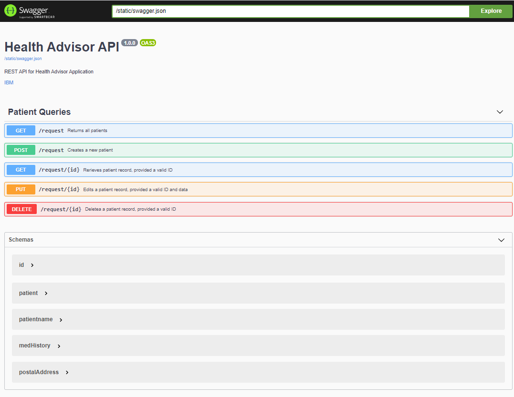

# Python API for HealthPlanner application

This is an implementation of the Health Advisor API is implemented using Swagger, Flask, Python and a MongoDB backend.

## Introduction
This project is to be used as a sample application by the practitioners participating in the Container Crush+ Hackathon.
The Health Planner Application has APIs that can be consumed to store and retrieve a patient’s health related data like height, weight, gender, medical history, etc.
This application has the following components: 
* A Python 3.x application implementing the APIs.
* MongoDB used to persist data
* Flask, a micro web framework written in Python for exposing RESTFul APIs
* flask-swagger-ui, a Flask blueprint for adding Swagger UI to the flask application
* flask-cors, a Flask extension for handling Cross Origin Resource Sharing (CORS)
* routes to create concise URL’s that are RESTful and validate-email, a python package for validating email format

## Usage

### Pre-requisites to be installed

* Git Bash: It’s a both CLI and GUI based tool to interact with GitHub repository. As a distributed SCM GitHub is our recommended way for source code management. [Install Git Bash](https://gitforwindows.org/)
* SSH key for Git repo: IBM GitHub repository does not allow http or https based access, so an ssh key needs to be generated locally and added to your ibm github account to clone any repository: 
{Steps for SSH](https://help.github.com/en/github/authenticating-to-github/generating-a-new-ssh-key-and-adding-it-to-the-ssh-agent)
* MongoDB: Download and install MongoDB Community Server (only server is needed) from [MongoDB] (https://www.mongodb.com/download-center/community) After installation add the bin directory to your path (e.g. in your Windows environment variable called path, add <code>C:\Program Files\MongoDB\Server\4.2\bin</code>)
* Python 3.x: Download and install the latest Python from 
{Python downloads site](https://www.python.org/downloads/) and add the install directory to your environment 
* Pymongo: Open gitbash and execute the following: <code>python -m pip install pymongo </code>
* Flask: Open gitbash and execute: 
```
 	$ pip install flask
 	$ pip install flask_swagger_ui
 	$ pip install -U flask-cors
 ```
 * Others: Open gitbash and execute: 
 ```
 	$ pip install routes
 	$ pip install validate_email
 ```
### Downloading and installing the application
* To setup the development environment you first need to clone the project from GitHub
* Check inside static/ properties.txt to see if the MongoDB related default properties are correct, else change them
```
mongodburl=mongodb://127.0.0.1:27017
mongodbname= healthplannerdb
```
* Now execute python app.py You should see a line that says <code>* Running on http://0.0.0.0:5000/</code> which means that the API is ready to be called.
* On your browser, navigate to http://127.0.0.1:5000/swagger and you should see a screen like the following

* Now try out the various APIs to see how they work. You first need to add some records using the post function to be able to retrieve or update records


### For local docker
* Create docker image and run
```
docker build -t healthapi-image . --no-cache
docker run -d --name healthapi -p 5000:5000 healthapi-image

```

